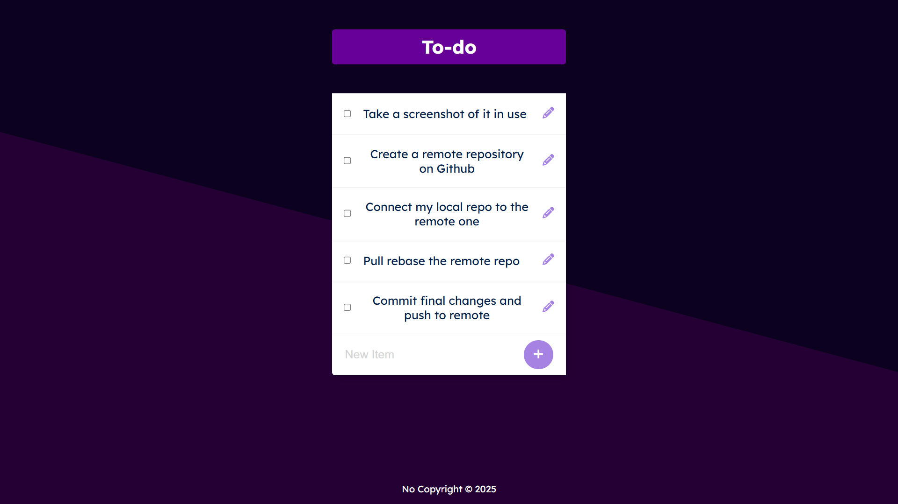

# Todo list
> Create, edit and save a list of things to-do!

Runs a to-do list on an *express* server, saving items to and updating a postgres database, and visualising with EJS.

## Getting started
1. Install modules with `npm install`
2. Create a new database and run the command found in `queries.sql` to get set up
3. Set up a `.env` file with the following environment variables:
    - PORT : The port that your express server is going to run on (e.g. 3000)
    - DB_NAME : The name of your database
    - DB_HOST : The name of your host (e.g. localhost)
    - DB_USER : Your database user name (e.g. postgres)
    - DB_PASSWORD : Your database password
    - DB_PORT : The port that your database is running on (e.g. 5432)
4. Start the server with `npm start`
5. Now just connect to `localhost:<process.env.PORT>` and get started!

### Acknowledgements

Thanks to <a href="https://appbrewery.com/">appbrewery</a> and their full-stack web development course for the skeleton of this project from which the functionality was added.
