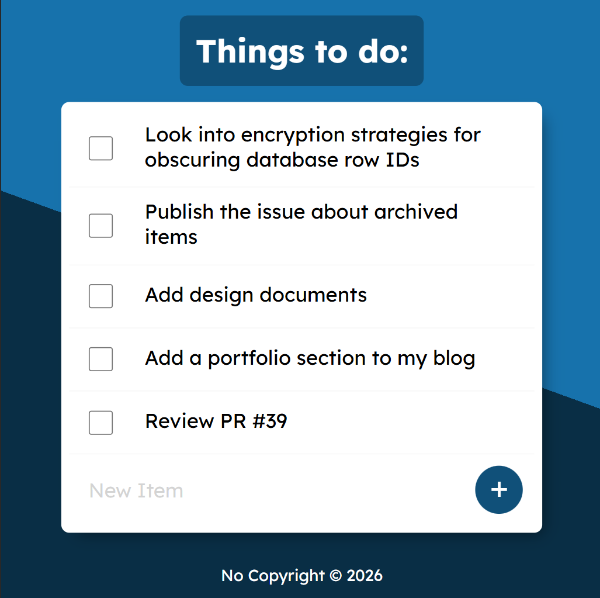

# Todo list

> Create, edit and save a list of things to-do!



Runs a to-do list on an *express* server, saving items to and updating a PostgreSQL database, and displays list items in a web interface with EJS

## Getting Started

If you're familiar with PostgreSQL, just follow these instructions:

1. Install modules with `npm install`
2. Run the command found in `queries.sql` to set up the table
3. Fill out a `.env` file using the provided `.env.example` one as a template
4. Start the server with `npm start`
5. Now just connect to `localhost:<PORT>` and get started!

### New to PostgreSQL?

If you're not familiar with PostgreSQL, here's some more guidance:

1. [Download and install PostgreSQL](https://www.postgresql.org/download/) for your platform if you don't have it already
2. Once successfully installed, open **pgAdmin** (included with PostgreSQL)
3. Create a new database (e.g. `todo`)
4. Right click your created database and select the Query Tool
5. Enter the following SQL to create the required table:
   ```sql
   CREATE TABLE IF NOT EXISTS items (
     id SERIAL PRIMARY KEY,
     text VARCHAR(100) NOT NULL
   );
   ```
   Alternatively, paste the contents of `queries.sql` into the query tool and execute it
6. Create a `.env` file in the project root based on `.env.example`, filling in your database credentials and desired port
7. Install dependencies with `npm install`, then start the server with `npm start`
8. Visit `localhost:<PORT>` in your browser (where `<PORT>` matches the value you set in `.env`)


## How to use

Type in your entries, and then: 

- Press `Enter`, or click the `+` button, to submit them
- Click the pen to edit your entry
- Click the box on the left of an entry to delete it

That's it!
